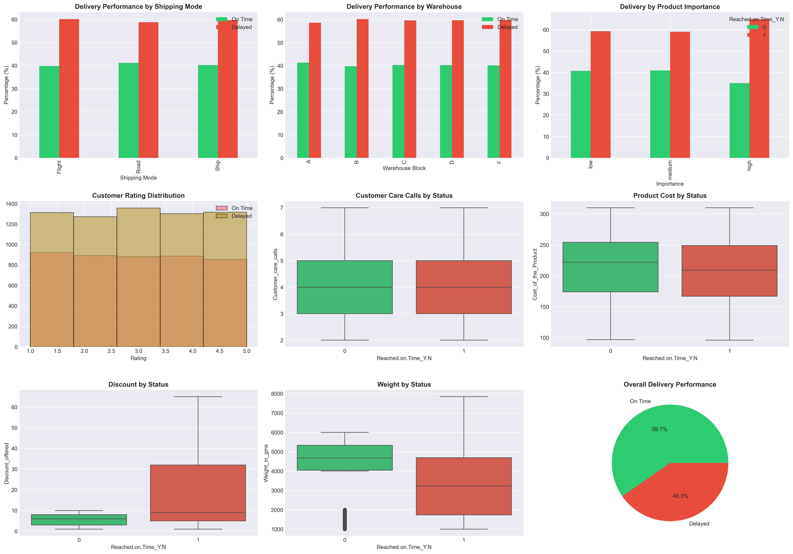
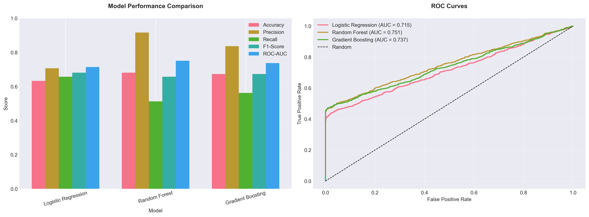

#  E-Commerce Delivery Time Prediction


Predict whether orders will be delivered on time using machine learning. Achieves 63.6% accuracy with Logistic Regression.


##  Project Overview

This project analyzes 10,999 e-commerce transactions to build a predictive model that identifies orders at risk of late delivery.

##  Key Findings

- **60% baseline delay rate** indicates systemic operational challenges
- **Discount paradox**: High discounts (>15%) correlate with delays
- **Weight matters**: Heavier items arrive on time more frequently
- **Priority problem**: High-importance products have worse performance

##  Tech Stack

- **Python 3.11** - Core language
- **Pandas & NumPy** - Data manipulation
- **Scikit-learn** - Machine learning
- **Streamlit** - Web application
- **Matplotlib & Seaborn** - Visualizations

##  Model Performance

| Model | Accuracy | Precision | Recall | F1-Score |
|-------|----------|-----------|--------|----------|
| Logistic Regression | 63.6% | 70.4% | 67.4% | 68.9% |
| Random Forest | 66.0% | 76.9% | 61.5% | 68.3% |
| Gradient Boosting | 68.0% | 90.9% | 51.5% | 65.7% |


##  Data Visualizations

### Exploratory Data Analysis


*Comprehensive analysis of delivery performance across different features including shipping mode, warehouse, product importance, customer ratings, and more.*

### Model Performance Comparison


*Performance metrics and ROC curves comparing Logistic Regression, Random Forest, and Gradient Boosting models.*


##  Quick Start
```bash
# Activate virtual environment
source venv/bin/activate

# Install dependencies
pip install -r requirements.txt
```

`
# Run analysis
`
python src/main_analysis.py


`
# Run Streamlit app
streamlit run app.py


``
##  Project Structure
```
ecommerce-delivery-prediction/
├── data/
│   └── e_commerce.csv
├── src/
│   ├── data_loader.py
│   ├── eda.py
│   ├── feature_engineering.py
│   ├── model_training.py
│   └── main_analysis.py
├── notebooks/
│   └── exploratory_analysis.ipynb
├── models/
│   └── best_model.pkl
├── outputs/
│   ├── visualizations/
│   └── reports/
├── app.py
├── requirements.txt
└── README.md
```


##  Key Recommendations
```

1. **Discount Strategy Overhaul** - Separate fulfillment for high-discount items
2. **Weight-Based Routing** - Special handling for lightweight products
3. **Priority Recalibration** - Fix high-importance item processing
4. **Predictive Interventions** - Deploy model for real-time risk flagging
```
##  Expected Business Impact

- Reduce delays from 60% to <45%
- Improve customer satisfaction by 20-25%
- Annual value: $1M-1.4M


##  Live Demo 🌐

**Try the interactive app:** 
To run the interactive Streamlit app locally:
```bash
streamlit run app.py
```

Then open your browser at `http://localhost:8501`

---


## ⭐ Star This Repository
**If you find this project useful, please give it a star ⭐!**
**[⭐ Click here to star this repo](https://github.com/je-79/ecommerce-delivery-prediction)**

---

 